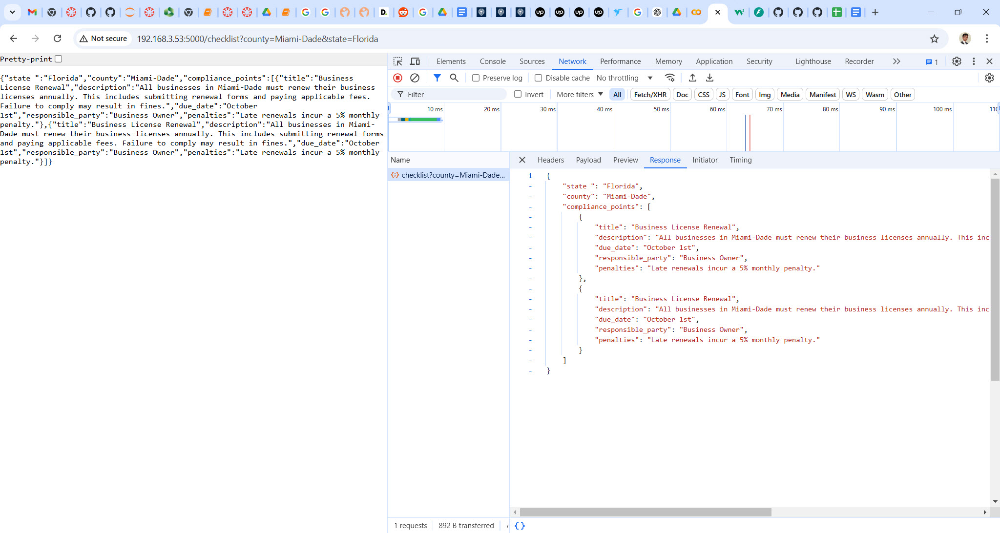

# Task 1

For this task, instead of writing python code and making API calls, I have simply written the prompts that were sent to ChatGPT and subsequent refinement of the prompt to get the desired outcome and avoid hallucinations by referencing tax regulations. 

## Prompt 1
What are the Sales Tax Filing requirements for Anderson County in Texas State. 

## Prompt 1 Output

In Texas, including Anderson County, sales tax is regulated at the state level rather than the county level, so businesses in Anderson County follow Texas state requirements for sales tax filing. Here are the key points:

1. **Sales Tax Permit Requirement**:
   - All businesses in Texas that sell taxable goods or services must register with the Texas Comptroller of Public Accounts to obtain a sales tax permit before they begin collecting sales tax. This permit allows businesses to collect the required sales tax from customers and remit it to the state.

2. **Filing Frequency**:
   - The Texas Comptroller determines the sales tax filing frequency based on the business’s taxable sales volume. Businesses with high sales volumes may be required to file monthly, while others might file quarterly or annually. Generally:
     - **Monthly Filers**: Businesses that collect $1,500 or more in state sales tax per month.
     - **Quarterly Filers**: Businesses that collect less than $1,500 but more than $500 in state sales tax per quarter.
     - **Annual Filers**: Businesses that collect less than $500 in state sales tax per year.

3. **Due Dates**:
   - **Monthly Filers**: Due by the 20th of the following month (e.g., January sales tax is due by February 20).
   - **Quarterly Filers**: Due by the 20th of the month following the end of the quarter (e.g., Q1 taxes are due by April 20).
   - **Annual Filers**: Due by January 20 of the following year for the prior year’s sales.

4. **Economic Nexus**:
   - Texas enforces economic nexus requirements for out-of-state sellers based on sales thresholds. If a business outside of Texas exceeds $500,000 in annual sales to Texas customers, it must collect and remit Texas sales tax, regardless of physical presence in the state.

5. **Penalties for Late Filing**:
   - Late filings can incur penalties and interest. Texas imposes a 5% penalty on unpaid sales tax if it’s not filed by the due date, and an additional 5% if it remains unpaid after 30 days. Interest also accrues on unpaid balances.

For more information, businesses can consult the [Texas Comptroller’s website](https://comptroller.texas.gov) to confirm their filing frequency, due dates, and any updates to tax laws specific to their industry or type of goods and services.

## Prompt 2
What are the Sales Tax Filing requirements for Anderson County in Texas State as per IRS tax guidelines. Please put the output in the Json format that I shared below (I have attached the sample JSON file).

## Prompt 2 Output

```json
{
  "compliance_points": [
    {
      "title": "Sales Tax Permit Requirement",
      "description": "All businesses selling taxable goods or services in Texas must obtain a sales tax permit from the Texas Comptroller. This requirement applies to both in-state businesses and out-of-state sellers with economic nexus in Texas (e.g., annual sales exceeding $500,000 to Texas customers).",
      "due_date": "Prior to collecting any sales tax in Texas",
      "responsible_party": "Business Owner",
      "penalties": "Operating without a permit can lead to fines and legal consequences, including back taxes owed."
    },
    {
      "title": "Sales Tax Filing Frequency",
      "description": "The Texas Comptroller sets sales tax filing frequency based on the volume of sales tax collected: monthly (over $1,500/month), quarterly (between $500 and $1,500/quarter), or annually (less than $500/year).",
      "due_date": "20th of the month following the reporting period (monthly, quarterly, or annually)",
      "responsible_party": "Business Owner or CPA",
      "penalties": "Late filings incur a 5% penalty if not filed by the due date, with an additional 5% after 30 days. Interest accrues on unpaid balances."
    },
    {
      "title": "Economic Nexus Compliance",
      "description": "Following the South Dakota v. Wayfair decision, Texas requires out-of-state businesses to collect and remit sales tax if they exceed $500,000 in sales to Texas customers, even if they lack a physical presence in the state.",
      "due_date": "Monthly, quarterly, or annually, depending on sales volume as determined by the Texas Comptroller",
      "responsible_party": "Business Owner or CPA",
      "penalties": "Failure to comply may lead to fines, back taxes, and possible audits."
    }
  ]
}
```

## Prompt 3
What are the Sales Tax Filing requirements for Anderson County in Texas State as per IRS tax guidelines and based on the United States federal regulations. Please put the output in the Json format that I shared below (I have attached the sample JSON file).

## Prompt 3 Output
```json
{
  "compliance_points": [
    {
      "title": "Sales Tax Collection and Remittance",
      "description": "Businesses with a physical or economic presence in Texas must collect and remit sales tax for all taxable transactions. Economic nexus rules apply to businesses with $500,000 or more in annual sales in the state. Businesses need to register with the Texas Comptroller’s office to obtain a sales tax permit before beginning tax collection.",
      "due_date": "Monthly by the 20th, or quarterly/annually depending on sales volume.",
      "responsible_party": "Business Owner or CPA",
      "penalties": "Failure to file or remit on time can result in penalties and interest charges, as well as potential audits."
    },
    {
      "title": "Economic Nexus Compliance",
      "description": "Businesses without a physical presence in Texas may still need to file if they meet the economic nexus threshold of $500,000 in sales. This rule, following the Wayfair decision, ensures that out-of-state sellers comply with Texas sales tax collection laws.",
      "due_date": "Varies based on the filing frequency determined by the Texas Comptroller, usually monthly, quarterly, or annually.",
      "responsible_party": "Business Owner or CPA",
      "penalties": "Non-compliance with economic nexus regulations may lead to back taxes, penalties, and interest charges."
    }
  ]
}
```

# Task 2

I have written a Python web server program that simulates an API response for compliance data. This program uses the Python `FastAPI` library and `uvicorn` Python web server. The program provides two REST API endpoints. 

## Endpoint 1 (the home page)

The homepage endpoint is used to display a generic text message (the message is ‘Upwork Tax Compliance Assignment.’)

This is the url that I used to display the generic text message `http://192.168.3.53:5000/` (output is shown below + note that the ip address used is from my local machine and the port number `5000` is what I set in `uvicorn.run()`)


## Endpoint 2
The second endpoint is used to return compliance data in a JSON format. This endpoint requires the input, using query string, for the state and county. The state and county data is used in the dummy JSON compliance data that is returned by the API. The compliance information within the JSON is structured using an array to allow multiple compliance results to be returned.

This is the url that I used to display the generic text message `http://192.168.3.53:5000/checklist?county=Miami-Dade&state=Florida` (output is shown below + note how I specified the county and state name in the URL)



## Scaling to multiple states and counties 

The current JSON data structure is suitable for a single state and county. It needs to be converted to a JSON array to allow results to be returned for multiple states and counties. Secondly, the JSON tags within the compliance needs to be conditional based on various compliance requirements across jurisdictions.

