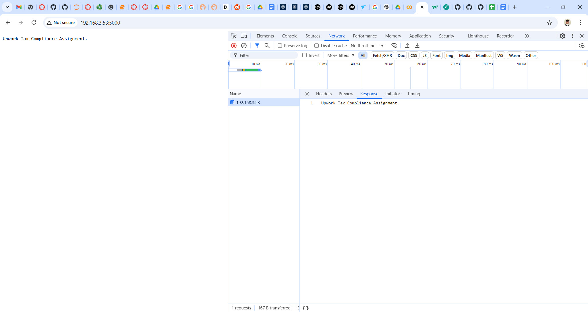

Upwork

# Task 2

I have written a Python web server program that simulates an API response for compliance data. This program uses the Python `FastAPI` library and `uvicorn` Python web server. The program provides two REST API endpoints. 

## Endpoint 1 (the home page)

The homepage endpoint is used to display a generic text message (the message is ‘Upwork Tax Compliance Assignment.’)

This is the url that I used to display the generic text message `http://192.168.3.53:5000/` (output is shown below + note that the ip address used is from my local machine and the port number `5000` is what I set in `uvicorn.run()`)

## Endpoint 2
The second endpoint is used to return compliance data in a JSON format. This endpoint requires the input, using query string, for the state and county. The state and county data is used in the dummy JSON compliance data that is returned by the API. The compliance information within the JSON is structured using an array to allow multiple compliance results to be returned.

This is the url that I used to display the generic text message `http://192.168.3.53:5000/checklist?county=Miami-Dade&state=Florida` (output is shown below + note how I specified the county and state name in the URL)

